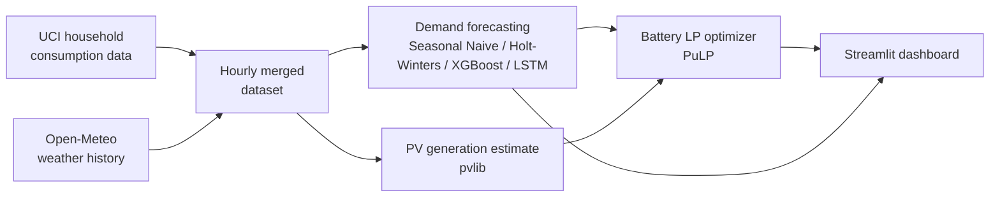

# Smart Home Energy Management System

[](https://github.com/elenakaskaveli/energy-ai-optimization/actions/workflows/ci.yml)

AI-driven system for a residential household that forecasts electricity demand,
optimizes battery storage scheduling, and recommends solar PV integration —
built on real consumption and weather data.

## Overview

Three components work together on a single-household scenario:

1. **Demand forecasting** — predicts hourly household electricity consumption
   using calendar and weather features. Seasonal naive and Holt-Winters
   baselines are compared against XGBoost and an LSTM sequence model.
2. **Battery storage optimization** — given the demand forecast and estimated
   solar generation, a linear program schedules battery charge/discharge to
   minimize electricity cost and maximize self-consumption of solar energy.
3. **Renewable integration analysis** — estimates rooftop solar PV output from
   historical irradiance and recommends system sizing to reach target
   self-sufficiency levels.



## Data

- **Consumption**: [UCI Individual Household Electric Power Consumption](https://archive.ics.uci.edu/dataset/235/individual+household+electric+power+consumption) (Sceaux, France, 2006–2010).
- **Weather**: [Open-Meteo Historical Weather API](https://open-meteo.com/en/docs/historical-weather-api) for the same location.
- **Solar PV**: modeled with [`pvlib`](https://pvlib-python.readthedocs.io/) from historical irradiance.

See [`data/README.md`](data/README.md) for details and fetch scripts.

## Results so far: demand forecasting

Models are compared on next-hour ("nowcast") and next-day ("day-ahead")
forecasting of household demand — the day-ahead scenario is the realistic
input for the battery optimization stage, since it has no access to data from
less than 24h before the target hour:

| Model                              | RMSE (kW) | MAE (kW) | MAPE (%) |
|-------------------------------------|-----------|----------|----------|
| XGBoost (nowcast, uses last hour)   | 0.49      | 0.34     | 42.7     |
| XGBoost (day-ahead)                 | 0.62      | 0.45     | 62.2     |
| LSTM                                | 0.65      | 0.48     | 65.7     |
| Seasonal naive (day-ahead)          | 0.82      | 0.56     | 68.7     |
| Holt-Winters                        | 1.15      | 0.98     | 187.2    |

XGBoost (day-ahead) is the model that feeds the battery optimization stage.
See [`notebooks/02_forecasting.ipynb`](notebooks/02_forecasting.ipynb) for the
full comparison, forecast plots, and a SHAP feature-importance breakdown.

## Results so far: battery storage optimization

A 5 kWp rooftop PV system (modeled with `pvlib` from historical irradiance)
and a 10 kWh battery are scheduled with a linear program (PuLP), and compared
against a greedy self-consumption heuristic and a no-battery baseline, over
all 314 full days of the test period:

| Strategy          | Total cost (314 days) | Savings vs. no battery |
|--------------------|-----------------------|-------------------------|
| No battery (PV only) | €1,053                | —                        |
| Heuristic (greedy)    | €707                  | 33%                      |
| LP-optimal            | €424                  | **60%**                  |

The LP schedule beats the heuristic by a further ~40% because it plans
ahead: it drains the battery during flat-price early-morning hours (when
timing doesn't affect cost) specifically to free up storage headroom before
the midday solar peak, so it can bank more of that surplus for the expensive
evening peak-price hours instead of exporting it at the much lower feed-in
credit. See [`notebooks/03_battery_optimization.ipynb`](notebooks/03_battery_optimization.ipynb).

## Project structure

```
energy-ai-optimization/
├── .github/workflows/ci.yml  # lint + test on every push/PR
├── config/config.yaml        # all tunable parameters (location, battery, tariff, models)
├── data/                     # raw/ and processed/ datasets (not committed, fetched locally)
├── src/
│   ├── data/                 # fetching, cleaning, feature engineering
│   ├── models/                # forecasting models
│   ├── optimization/          # battery scheduling (linear programming)
│   ├── solar/                 # PV generation estimation
│   └── evaluation/            # metrics and model comparison
├── notebooks/                 # exploratory analysis and model development (executed, with outputs)
├── dashboard/                 # Streamlit app
├── tests/                     # pytest suite
└── reports/                   # generated figures, tables, and summaries
```

## Setup

```bash
python -m venv .venv
source .venv/bin/activate
pip install -r requirements.txt
```

## Usage

```bash
# 1. Fetch and build the dataset
python -m src.data.fetch_consumption
python -m src.data.fetch_weather
python -m src.data.build_dataset

# 2. Train and compare demand forecasting models
python -m src.run_forecasting

# 3. Estimate solar PV generation and optimize battery scheduling
python -m src.run_battery_optimization

# 4. Run the dashboard
streamlit run dashboard/app.py
```

## Dashboard

An interactive Streamlit dashboard ties everything together:

- **Demand Forecast** — actual vs. predicted household demand for any day in the test period, with a model selector
- **Battery & Solar** — pick a day and adjust battery capacity / PV size / peak price sliders to see the cost impact live
- **Model Comparison** — the forecasting model comparison table and SHAP feature-importance plot

## Testing & CI

```bash
pytest tests/ -v        # 19 tests: data pipeline, features, models, battery optimization
ruff check src tests    # lint
black src tests         # format
```

GitHub Actions runs lint + the full test suite on every push and pull request
(see [`.github/workflows/ci.yml`](.github/workflows/ci.yml)).

## Limitations

- **Single household, not a grid.** The consumption data is from one home in
  Sceaux, France (2006–2010) — a well-established, complete public dataset,
  chosen for reproducibility over recency. The methodology (forecasting,
  optimization) is not tied to that specific household or period.
- **PV and battery are simulated, not measured.** Solar generation is modeled
  from historical irradiance with `pvlib`; the battery has realistic but
  configurable specs (`config/config.yaml`). Real deployment would use actual
  system specs and metered generation.
- **Weather is treated as a perfect forecast.** The models use historical
  (observed) weather rather than day-ahead weather forecasts, which is a
  common simplification — a production system would swap in a weather
  forecast API for the day-ahead scenario.

## Tech stack

Python · pandas · scikit-learn · XGBoost · TensorFlow · statsmodels · pvlib · PuLP · Streamlit · pytest

## License

MIT — see [LICENSE](LICENSE).
